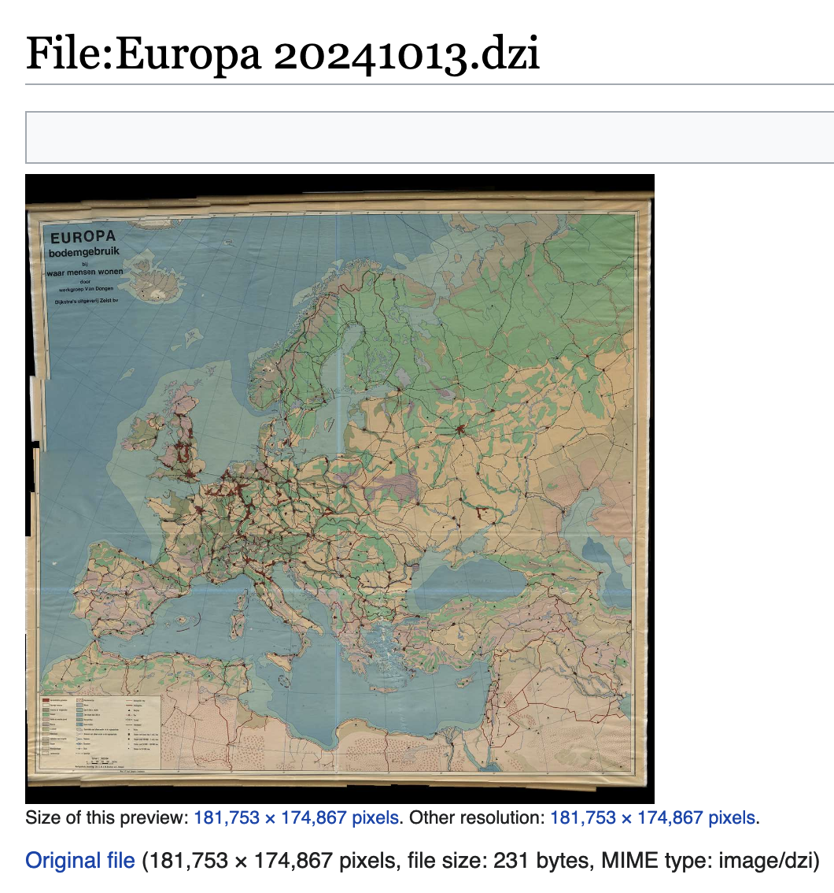

# MediaWiki DeepZoom



A MediaWiki extension adding support for the DeepZoomImage format by Microsoft. The backing images themselves are intended to be hosted on a separate server. An example of this extension can be found on my [Map Wiki](https://mapwiki.tgrcode.com/File:Europa_20241013.dzi).

## Install

Git clone this repository to your `extensions` directory. Add the following to your `LocalSettings.php`.

```php
wfLoadExtension('DeepZoom');
$wgFileExtensions[] = 'dzi';
unset($wgMimeTypeExclusions[array_search('application/xml', $wgMimeTypeExclusions)]);
```

Run the following to update the magic words database.

```bash
php maintenance/rebuildLocalisationCache.php
```

## Usage

A DZI can be uploaded to your MediaWiki instance, as long as it contains the `Url` field that links to the images. Here is an example of a valid DZI.

```xml
<?xml version="1.0"?>
<Image TileSize="254" Overlap="1" Format="jpg" Url="https://example.com/maps/utrecht_files/" xmlns="http://schemas.microsoft.com/deepzoom/2008">
  <Size Width="101010" Height="90909" />
</Image>
```

The DeepZoomImage can be embedded like a normal image, with the OpenSeaDragon viewer automatically provided.

```
[[File:Utrecht.dzi|Map of Utrecht]]
```

At the moment this extension is not compatible with MultimediaViewer. To navigate to the file information page double click on the viewer.

The default orientation of the image can be provided like so.

```
[[File:Utrecht.dzi|frame|left|z=11.3113|x=0.5383|y=0.3483|Dithering on a map of Utrecht]]
```